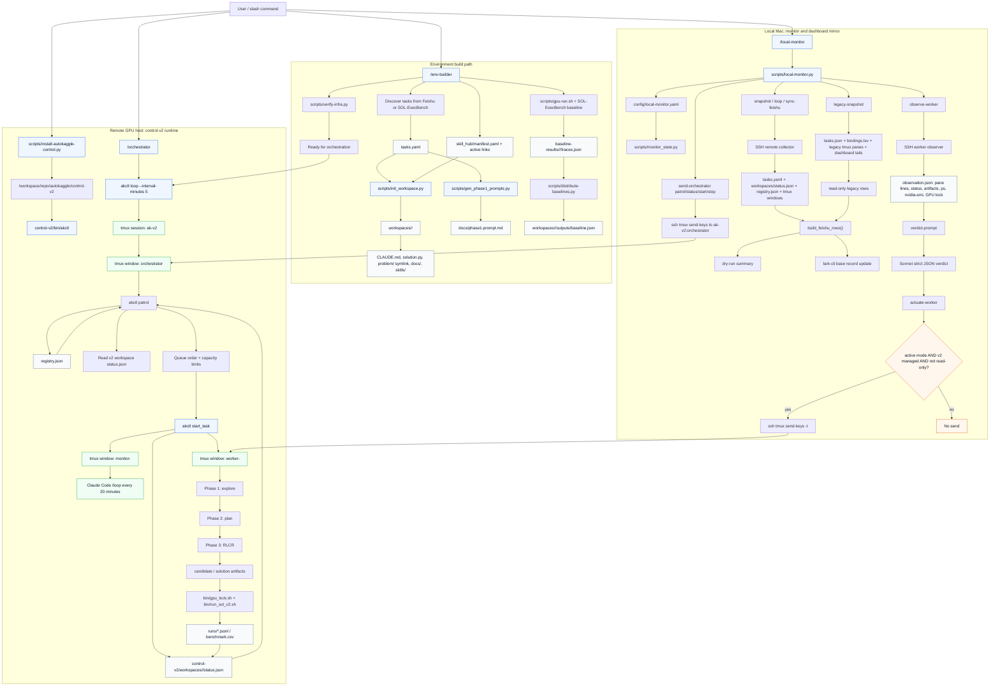

# Execution Flow

This repo has three normal user-facing roles:

- `/env-builder`: builds task workspaces, readiness artifacts, and skill hub links.
- `/orchestrator`: runs on the GPU host and owns scheduling intent.
- `/local-monitor`: runs on the local Mac, mirrors remote state, syncs Feishu, and sends high-level requests back to the orchestrator.

The remote v2 control plane is installed by `scripts/install-autokaggle-control.py`.
After install, `/workspace/repo/autokaggle/control-v2/bin/akctl` owns the
deterministic queue reconciliation, capacity checks, worker starts, per-worker
monitor starts, and orchestrator loop trigger.

## Main Control Boundaries

- The remote orchestrator owns scheduling intent, but `akctl patrol` performs the deterministic queue and capacity decisions.
- The local monitor does not start or kill workers directly. It sends `[local-monitor] ...` requests into the orchestrator tmux window.
- Worker-level nudges target the recorded `pane_id`, and only after an observation plus verdict.
- Legacy autokaggle imports are visibility only: `managed_by=legacy` and `read_only=true`.
- GPU-bound work should pass through `gpu-run.sh` or the v2 `gpu_lock.sh`/`run_sol_v2.sh` wrappers so shared GPU locks serialize benchmarks.
